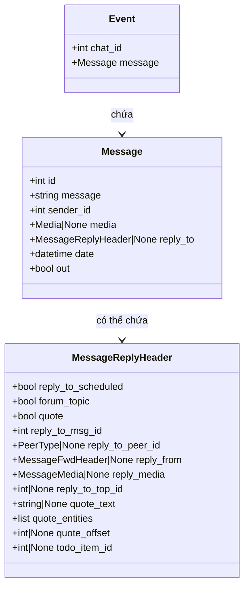
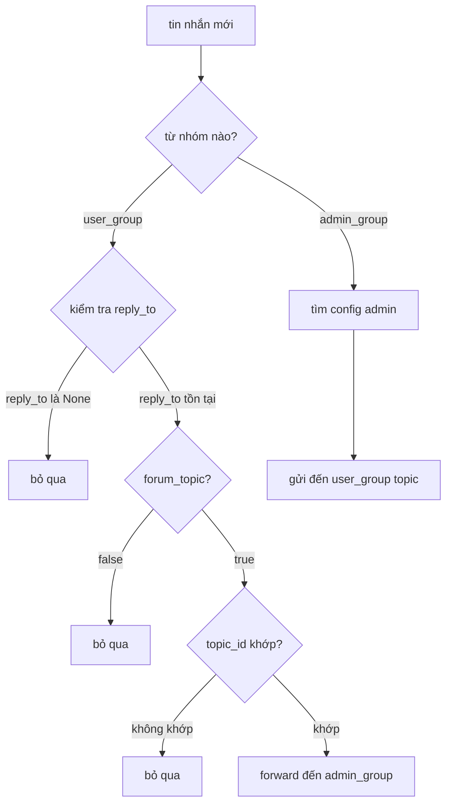
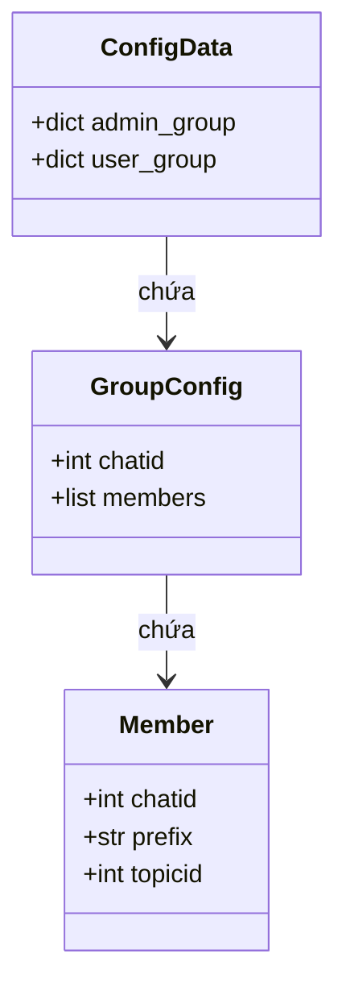
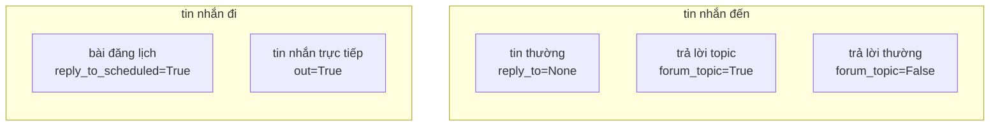
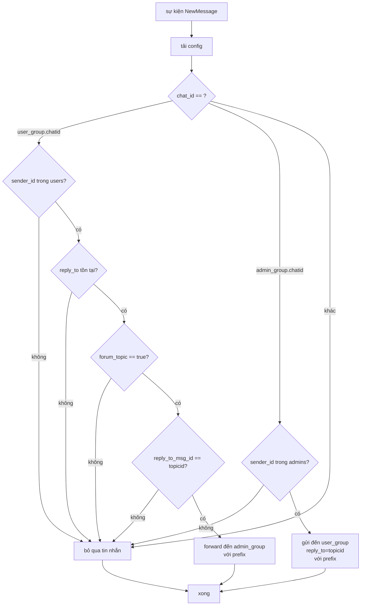

# tlsync technical

## telethon event object

```python
event.chat_id              # id nhóm (channel_id)
event.message.id           # id tin nhắn
event.message.message      # nội dung text
event.message.sender_id    # id người gửi (user_id)
event.message.media        # none hoặc media (ảnh, video, file)
event.message.reply_to     # none hoặc MessageReplyHeader
event.message.date         # thời gian gửi
event.message.out          # true nếu tin gửi đi, false nếu tin nhận
```

**check forum topic:**

```python
event.message.reply_to.forum_topic        # true nếu là forum topic
event.message.reply_to.reply_to_msg_id    # topic id được reply
```

**log:**

```text
# tin thường (k reply) - từ admin_group
channel_id=3538180541, user_id=6656772173
reply_to=None
message='admin gửi nè'

# tin thường (k reply) - từ user_group
channel_id=3565628485, user_id=7818631225
reply_to=None
message='không forward nè'

# tin reply vào topic - từ user_group
channel_id=3565628485, user_id=7818631225
reply_to=MessageReplyHeader(
    reply_to_scheduled=False,
    forum_topic=True,        # key: là forum topic
    quote=False,
    reply_to_msg_id=3,       # topic id
    reply_to_peer_id=None,
    reply_from=None,
    reply_media=None,
    reply_to_top_id=None,
    quote_text=None,
    quote_entities=[],
    quote_offset=None,
    todo_item_id=None,
)
message='forward từ user nè'
```

**lưu ý:**

- `event.chat_id` là `channel_id` trong `peer_id`
- `event.message.sender_id` là `user_id` trong `from_id`
- khi user reply topic, `reply_to.forum_topic=true` và `reply_to_msg_id` là topic id
- khi admin gửi tin thường, `reply_to=None`

---

## event object structure



## message flow logic



## config structure



## message types



## handler logic detail



---

## docs

- [telethon events reference](https://docs.telethon.dev/en/stable/quick-references/events-reference.html)
- [telethon updates](https://docs.telethon.dev/en/stable/basic/updates.html)
- [telethon concepts entities](https://docs.telethon.dev/en/stable/concepts/entities.html)
- [message fields](https://docs.telethon.dev/en/stable/modules/custom.html)
